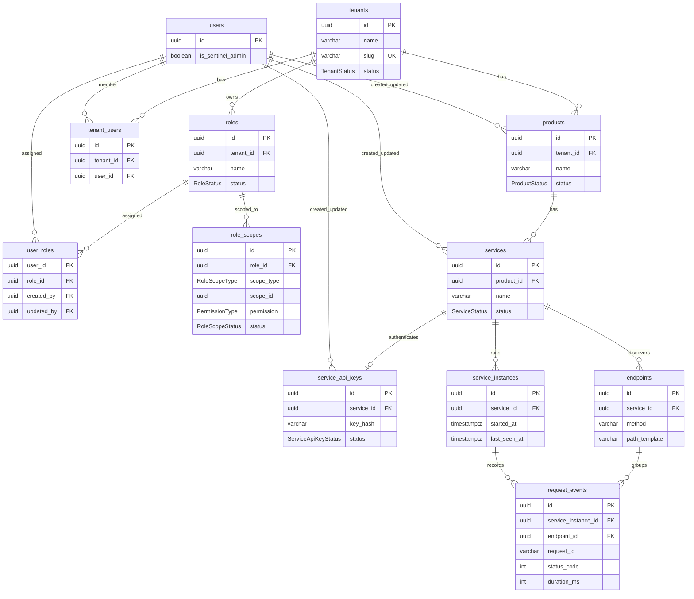

# Catalog & Request Observability — Schema Design

Working design doc (Step 1). Not Liquibase / not DDL yet.

## Requirements summary (aligned so far)

- Many companies (tenants); each has products; each product has services
- **`tenant_users`** maps dashboard users to a company
- **Tenant-scoped RBAC:** roles belong to a tenant; permissions are a small static set; **scopes** limit access to tenant / product(s) / service(s)
- **One user can have multiple roles** via `user_roles`; effective access = **union** of those roles’ permissions + scopes
- **Platform operator:** `users.is_sentinel_admin = true` — can do **anything in any company**; not tied to roles/permissions
- **Tenant admin:** tenant role e.g. `Admin` with permission `ALL` + scope `TENANT` — anything **inside that company only**
- Limited tenant roles use per-scope `READ` / `READ_AND_WRITE` / `ALL`
- Permission lives on **`role_scopes`** (not a separate role_permissions table): **`ALL` | `READ` | `READ_AND_WRITE`**
- **`roles.tenant_id` is mandatory** — every role belongs to a company
- Registration / ingest at **service** level (API key); **one key per service** (all instances share it)
- Endpoints are **traffic-learned** (no manual catalog of 1000+ routes)
- **Prod only** — no staging/env dimension in v1
- Request events: identity + call + outcome; **no** bodies/headers
- Deploy/runtime facts live on **service_instance**, not denormalized on every request
- Always store `user_id` when agent has it; also `end_user_ip`, `request_id`, `occurred_at`
- One correlation id only: **`request_id`** (no separate `trace_id` in v1)
- Store response outcome: `status_code`, `duration_ms` (no stored `success` — derive from status)
- Store **request/response sizes** (bytes) — not bodies
- No `slug` on products/services; no denormalized method/path on request events
- Prefer **soft-disable** (`INACTIVE`) over hard delete so request history is not wiped
- Endpoint↔instance same-service check: **application validation** (not a DB constraint)
- Request retention / partitioning: **later**

Out of scope for this schema slice:

- OpenAPI import
- Kafka topic design (ingest pipeline can come after tables)

---

## Design notes (decisions from review)

| Topic | Decision |
|--------|----------|
| `key_prefix` | **Removed.** Hash + name is enough for v1. Show raw key once at creation. |
| `instance_key` | **Removed.** Agent registers once, keeps `service_instances.id`. |
| `service_version` | **Removed.** |
| Instance `created_at` / `status` / `updated_at` | **Removed.** Liveness from `last_seen_at` (heartbeat only). |
| Endpoint `created_at` / `updated_at` | **Removed.** Use `first_seen_at` / `last_seen_at`. |
| `trace_id` | **Removed.** `request_id` only. |
| method / path on events | **Removed.** Join via `endpoint_id`. |
| `success` | **Removed.** Derive in app/UI (`status_code < 400` or similar). |
| Sizes | **Added** `request_size_bytes` / `response_size_bytes` (nullable). |
| `tenant_users` | **Added.** Maps users ↔ company. |
| Endpoint vs instance service | **App validation** on ingest — reject if `endpoint.service_id != instance.service_id`. |
| Hard delete vs history | **App rule:** soft-disable services/products/tenants; do not hard-delete when request history exists. FK deletes on history tables are **RESTRICT**. |
| Retention | **Later.** |
| API keys | **One key per service.** All instances of that service share the same key. |
| Tenant RBAC | Roles are **per tenant**. Static permissions + dynamic **role_scopes**. |
| Multi-role users | One user → many **tenant** roles via `user_roles`. Access = **union**. |
| Platform admin | `users.is_sentinel_admin` — not a role. |
| Roles | Always require `tenant_id`. |
| Platform vs tenant | Platform: `users.is_sentinel_admin`. Tenant: roles (always with `tenant_id`) + permissions + scopes. |

### Platform vs tenant access

| Layer | Who | How | Power |
|-------|-----|-----|--------|
| **Platform** | Sentinel operator | `users.is_sentinel_admin = true` | **Anything in any company** |
| **Tenant admin** | Company admin | Tenant role with `ALL` + scope `TENANT` | **Anything in that company only** |
| **Limited member** | Company user | Per-scope `READ` / `READ_AND_WRITE` / `ALL` on products/services | Only those scope rows |

- Role assignment: **`user_roles`** (tenant roles only).
- App rule: assigning a role requires the user in `tenant_users` for that `role.tenant_id`.
- Platform admins do **not** need roles or `user_roles` for operator power.

### Access model (roles × scopes)

```text
User
  ├── is_sentinel_admin? → full platform access (skip roles)
  ├── user_roles *── roles (always tenant-owned)
  │                    └── role_scopes * → (TENANT|PRODUCT|SERVICE) + permission (ALL|READ|READ_AND_WRITE)
  └── tenant_users → membership in company
```

| Scope type | `scope_id` | Sees |
|------------|------------|------|
| `TENANT` | `NULL` | All products & services in the tenant |
| `PRODUCT` | `product_id` | All services under that product (incl. future ones) |
| `SERVICE` | `service_id` | Only that service |

A role may have **many** scope rows (e.g. two products + one extra service).  
A user with roles A and B gets **A ∪ B** (permissions and visible resources).

---

## Tables & relationships

```
users (is_sentinel_admin) 
users *──* roles (user_roles)              ← tenant role assignment only
tenants 1──* tenant_users *──1 users       ← membership only
tenants 1──* roles                         ← tenant_id NOT NULL
roles 1──* role_scopes                     ← scope + permission per row

tenants 1──* products 1──* services 1──* service_instances
                              │
                              ├──1 service_api_key
                              ├──* endpoints
                              └──* (via instance) request_events
```

Ownership:

| Child | Parent FK |
|-------|-----------|
| `tenant_users` | `tenants.id`, `users.id` |
| `roles` | `tenants.id` (**required**) |
| `role_scopes` | `roles.id` + scope + **permission** |
| `user_roles` | `users.id`, `roles.id` |
| `products` | `tenants.id` |
| `services` | `products.id` |
| `service_api_keys` | `services.id` |
| `service_instances` | `services.id` |
| `endpoints` | `services.id` |
| `request_events` | `service_instances.id`, `endpoints.id` |

`created_by` / `updated_by` on tenants, products, services, api_keys, and roles → `users.id`.

---

## Columns (logical)

Types assume project conventions: UUID PKs, `TIMESTAMPTZ` / `Instant` for times.

### 1. `tenants` (company / customer)

| Column | Type | Null | Notes |
|--------|------|------|--------|
| `id` | UUID | NO | PK |
| `name` | VARCHAR(255) | NO | Display name |
| `slug` | VARCHAR(100) | NO | Unique, URL-safe |
| `status` | ENUM `TenantStatus` | NO | |
| `created_by` | UUID | NO | FK → `users.id` (typically a sentinel admin) |
| `updated_by` | UUID | NO | FK → `users.id` |
| `created_at` | TIMESTAMPTZ | NO | |
| `updated_at` | TIMESTAMPTZ | NO | |

**Unique:** `slug`  
**FK:** `created_by`, `updated_by` → `users(id)` ON DELETE RESTRICT  

Multiple users may have `is_sentinel_admin = true`; `created_by` records which operator created the company.

### 2. `tenant_users`

Maps a dashboard user to a company (membership only).

| Column | Type | Null | Notes |
|--------|------|------|--------|
| `id` | UUID | NO | PK |
| `tenant_id` | UUID | NO | FK → `tenants.id` |
| `user_id` | UUID | NO | FK → `users.id` |

**Unique:** `(tenant_id, user_id)`  
**FK:** `tenant_id` → `tenants(id)` ON DELETE CASCADE  
**FK:** `user_id` → `users(id)` ON DELETE CASCADE  

No status/timestamps — presence of the row = membership. Roles assigned via `user_roles`.

### 3. ~~`permissions` / `role_permissions`~~ (removed)

Permission is stored **per scope row** on `role_scopes`.

**Allowed values:** `ALL` | `READ` | `READ_AND_WRITE`

| Value | Meaning |
|-------|---------|
| `ALL` | Full power within that scope (e.g. tenant Admin + `TENANT` scope) |
| `READ` | View only in that scope |
| `READ_AND_WRITE` | Read + create/update in that scope |

### 4. `roles` (tenant-owned only)

| Column | Type | Null | Notes |
|--------|------|------|--------|
| `id` | UUID | NO | PK |
| `tenant_id` | UUID | NO | FK → `tenants.id` (required) |
| `name` | VARCHAR(255) | NO | e.g. `Admin`, `Checkout viewers` |
| `status` | ENUM `RoleStatus` | NO | |
| `created_by` | UUID | NO | FK → `users.id` |
| `updated_by` | UUID | NO | FK → `users.id` |
| `created_at` | TIMESTAMPTZ | NO | |
| `updated_at` | TIMESTAMPTZ | NO | |

**Unique:** `(tenant_id, name)`  
**FK:** `tenant_id` → `tenants(id)` ON DELETE CASCADE  

**Typical tenant seed role (when company created):** `Admin` with one `role_scopes` row: `TENANT` + permission `ALL`.

### 5. ~~`role_permissions`~~ (removed)

See `role_scopes.permission` instead.

### 6. `role_scopes` (scope + permission)

| Column | Type | Null | Notes |
|--------|------|------|--------|
| `id` | UUID | NO | PK |
| `role_id` | UUID | NO | FK → `roles.id` |
| `scope_type` | ENUM `RoleScopeType` | NO | TENANT / PRODUCT / SERVICE |
| `scope_id` | UUID | YES | `NULL` if TENANT; else product_id or service_id |
| `permission` | ENUM `PermissionType` | NO | `ALL` \| `READ` \| `READ_AND_WRITE` |
| `status` | ENUM `RoleScopeStatus` | NO | ACTIVE / INACTIVE |
| `created_by` | UUID | NO | FK → `users.id` |
| `updated_by` | UUID | NO | FK → `users.id` |
| `created_at` | TIMESTAMPTZ | NO | |
| `updated_at` | TIMESTAMPTZ | NO | |

**FK:** `role_id` → `roles(id)` ON DELETE CASCADE  
**FK:** `created_by`, `updated_by` → `users(id)` ON DELETE RESTRICT  
**Unique:** partial indexes for TENANT vs PRODUCT/SERVICE  

**App rules:**

- `TENANT` → `scope_id` NULL; at most one TENANT scope per role  
- `PRODUCT` → product in same tenant; covers that product’s services with this row’s permission  
- `SERVICE` → service in same tenant; grant without product-level access  
- Example: Product A `READ`, Product B `READ_AND_WRITE`, Service X `READ` — three rows  
- Only **ACTIVE** scopes count  

### 7. `user_roles` (tenant role assignment)

Simple join: user ↔ role.

| Column | Type | Null | Notes |
|--------|------|------|--------|
| `user_id` | UUID | NO | FK → `users.id` |
| `role_id` | UUID | NO | FK → `roles.id` |

**PK:** `(user_id, role_id)`  

**App rule:** user must exist in `tenant_users` for `role.tenant_id`.

Platform operators (`is_sentinel_admin`) do not need rows here for operator access.

### 8. `products`

| Column | Type | Null | Notes |
|--------|------|------|--------|
| `id` | UUID | NO | PK |
| `tenant_id` | UUID | NO | FK → `tenants.id` |
| `name` | VARCHAR(255) | NO | |
| `status` | ENUM `ProductStatus` | NO | |
| `created_by` | UUID | NO | FK → `users.id` |
| `updated_by` | UUID | NO | FK → `users.id` |
| `created_at` | TIMESTAMPTZ | NO | |
| `updated_at` | TIMESTAMPTZ | NO | |

**FK:** `tenant_id` → `tenants(id)` ON DELETE RESTRICT  
**FK:** `created_by`, `updated_by` → `users(id)` ON DELETE RESTRICT

### 9. `services`

| Column | Type | Null | Notes |
|--------|------|------|--------|
| `id` | UUID | NO | PK |
| `product_id` | UUID | NO | FK → `products.id` |
| `name` | VARCHAR(255) | NO | |
| `status` | ENUM `ServiceStatus` | NO | |
| `created_by` | UUID | NO | FK → `users.id` |
| `updated_by` | UUID | NO | FK → `users.id` |
| `created_at` | TIMESTAMPTZ | NO | |
| `updated_at` | TIMESTAMPTZ | NO | |

**FK:** `product_id` → `products(id)` ON DELETE RESTRICT  
**FK:** `created_by`, `updated_by` → `users(id)` ON DELETE RESTRICT

### 10. `service_api_keys`

**One key per service.** Every instance of that service authenticates ingest with the same key.

| Column | Type | Null | Notes |
|--------|------|------|--------|
| `id` | UUID | NO | PK |
| `service_id` | UUID | NO | FK → `services.id` |
| `name` | VARCHAR(255) | NO | Label, e.g. `default` |
| `key_hash` | VARCHAR(255) | NO | Store hash only |
| `status` | ENUM `ServiceApiKeyStatus` | NO | |
| `created_by` | UUID | NO | FK → `users.id` |
| `updated_by` | UUID | NO | FK → `users.id` |
| `created_at` | TIMESTAMPTZ | NO | |
| `updated_at` | TIMESTAMPTZ | NO | |
| `revoked_at` | TIMESTAMPTZ | YES | Set when status → REVOKED |

**FK:** `service_id` → `services(id)` ON DELETE CASCADE  
**FK:** `created_by`, `updated_by` → `users(id)` ON DELETE RESTRICT  
**Unique:** `key_hash`  
**Unique:** `service_id` — at most one key row per service  

No `last_used_at` — use `service_instances.last_seen_at` / traffic instead (avoids hot-row updates on ingest).

Rotation = revoke/replace that single key (all instances must pick up the new secret).

### 11. `service_instances`

| Column | Type | Null | Notes |
|--------|------|------|--------|
| `id` | UUID | NO | PK — agent correlation id after register |
| `service_id` | UUID | NO | FK → `services.id` |
| `started_at` | TIMESTAMPTZ | NO | Process boot time (immutable) |
| `last_seen_at` | TIMESTAMPTZ | NO | Updated on **agent heartbeat only** (not per request) |

**FK:** `service_id` → `services(id)` ON DELETE RESTRICT  

**Liveness:** alive if `last_seen_at` within threshold; else stale (computed). Request ingest must not bump this column.
### 12. `endpoints`

| Column | Type | Null | Notes |
|--------|------|------|--------|
| `id` | UUID | NO | PK |
| `service_id` | UUID | NO | FK → `services.id` |
| `method` | VARCHAR(16) | NO | GET, POST, … |
| `path_template` | VARCHAR(512) | NO | e.g. `/users/{id}` |
| `first_seen_at` | TIMESTAMPTZ | NO | |
| `last_seen_at` | TIMESTAMPTZ | NO | |

**Unique:** `(service_id, method, path_template)`  
**FK:** `service_id` → `services(id)` ON DELETE RESTRICT  

### 13. `request_events`

| Column | Type | Null | Notes |
|--------|------|------|--------|
| `id` | UUID | NO | PK |
| `service_instance_id` | UUID | NO | FK → `service_instances.id` |
| `endpoint_id` | UUID | NO | FK → `endpoints.id` |
| `request_id` | VARCHAR(128) | YES | Sole correlation id |
| `occurred_at` | TIMESTAMPTZ | NO | From agent |
| `end_user_ip` | VARCHAR(64) | YES | |
| `user_id` | VARCHAR(128) | YES | Opaque end-user id from customer app |
| `status_code` | INT | NO | HTTP status |
| `duration_ms` | INT | NO | |
| `request_size_bytes` | INT | YES | |
| `response_size_bytes` | INT | YES | |
| `received_at` | TIMESTAMPTZ | NO | Sentinel accept time |

**FKs:**

- `service_instance_id` → `service_instances(id)` ON DELETE RESTRICT  
- `endpoint_id` → `endpoints(id)` ON DELETE RESTRICT  

**App validation:** `endpoint.service_id` must equal `service_instance.service_id`.

**Indexes (recommended):**

- `(service_instance_id, occurred_at DESC)`
- `(endpoint_id, occurred_at DESC)`
- `(occurred_at DESC)`
- `(request_id)` where not null
- `(user_id, occurred_at DESC)` where user_id not null
- `(status_code, occurred_at DESC)`

---

## Enums (all allowed values)

### `TenantStatus`

| Value | Meaning |
|-------|---------|
| `ACTIVE` | Tenant can use the product |
| `INACTIVE` | Soft-disabled |

### `Permission` (on `role_scopes.permission`)

| Value | Meaning |
|-------|---------|
| `ALL` | Full power in that scope |
| `READ` | Read only in that scope |
| `READ_AND_WRITE` | Read + write in that scope |

### `RoleStatus`

| Value | Meaning |
|-------|---------|
| `ACTIVE` | Role can be assigned |
| `INACTIVE` | Soft-disabled |

### `RoleScopeType`

| Value | Meaning |
|-------|---------|
| `TENANT` | Whole company (`scope_id` NULL) |
| `PRODUCT` | One product (`scope_id` = product id) |
| `SERVICE` | One service (`scope_id` = service id) |

### `RoleScopeStatus`

| Value | Meaning |
|-------|---------|
| `ACTIVE` | Scope grant applies |
| `INACTIVE` | Soft-disabled; ignored in access checks |

### `ProductStatus`

| Value | Meaning |
|-------|---------|
| `ACTIVE` | Product in use |
| `INACTIVE` | Soft-disabled |

### `ServiceStatus`

| Value | Meaning |
|-------|---------|
| `ACTIVE` | Allowed to ingest |
| `INACTIVE` | Soft-disabled; reject ingest |

### `ServiceApiKeyStatus`

| Value | Meaning |
|-------|---------|
| `ACTIVE` | Key accepted for ingest |
| `REVOKED` | Permanently unusable; `revoked_at` set |

---

## Mermaid ER diagram



---

## How access resolution works (dashboard)

1. If `user.is_sentinel_admin` → **any company, any action**.
2. Else resolve `tenant_users` for the active company (must be a member).
3. Load `user_roles` → roles for that `tenant_id`.
4. Union ACTIVE `role_scopes` (each carries its own permission).
5. For a resource, pick the matching scope (SERVICE > PRODUCT > TENANT) and enforce that row’s permission.
6. Filter catalog and request queries accordingly.

---

## How instance life + requests work

1. Agent authenticates with the service’s **single** `service_api_keys` row (any instance of that service uses the same key).
2. On boot, agent **registers** a `service_instances` row (`started_at`, `last_seen_at`) and keeps the returned `id`.
3. Periodic **heartbeats** update `last_seen_at` only (not on every request).
4. Each prod call upserts `endpoints` on `(service_id, method, path_template)`.
5. Inserts `request_events` with `service_instance_id` + `endpoint_id` + outcome/identity fields (after same-service validation).
6. UI: instance → events; join endpoint for method/path; join instance for `started_at` / liveness.

---

## Still open before freeze

1. Exact mapping of API actions to `READ` vs `READ_AND_WRITE` vs `ALL`.

---

## Approval

Please review this revised schema. Reply with approval or a change list; after approval we freeze the contract (Step 2) before Liquibase.
