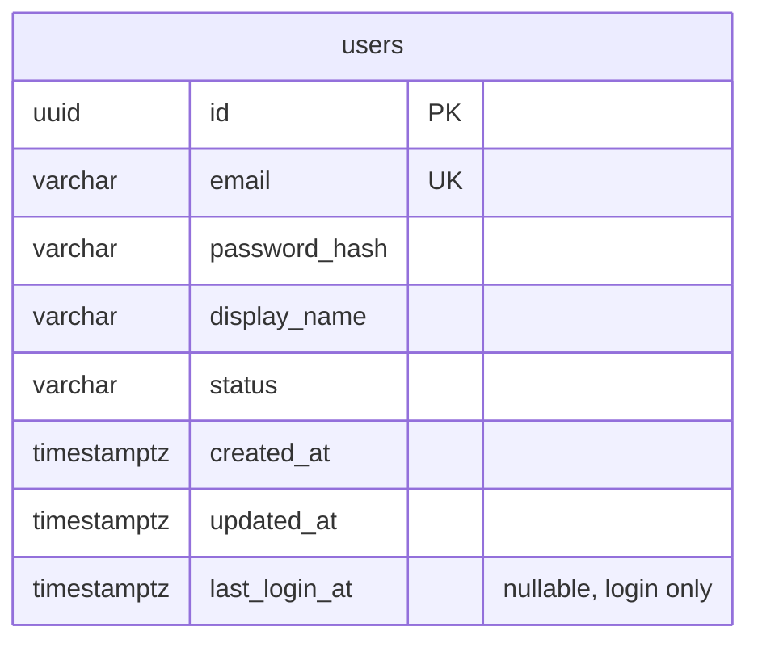

# Last login — schema & contract

**Status:** frozen (revised)  
**Parent:** extends existing [auth](auth.md) feature and [profile](profile.md) (`users` table + profile API)

## Requirements summary

Track when a user last successfully authenticated with email + password.

- Add `last_login_at` on `users`
- Update **only** on successful `POST /api/auth/login` (password login)
- Do **not** update on refresh-token, change-password re-issue, or logout
- Expose on `GET /api/auth/profile` and show on the profile page
- `updated_at` remains for intentional profile/data edits only — **must not change** when recording login
- Liquibase: **modify existing** `001-create-auth.sql` only (no new migration file)

## Schema

### users (add column)

| Column | Type | Null | Notes |
|--------|------|------|-------|
| last_login_at | TIMESTAMPTZ | YES | Set on successful password login; `NULL` until first login |

All other `users` columns unchanged ([auth.md](auth.md)).



### Liquibase

Edit `server/src/main/resources/db/changelog/migrations/001-create-auth.sql` — add to `CREATE TABLE users`:

```sql
last_login_at TIMESTAMP WITH TIME ZONE,
```

**Note:** This applies on fresh DB runs only. If `001` already ran locally, drop/recreate or manually `ALTER TABLE users ADD COLUMN last_login_at ...` for dev.

## API contract

No new endpoints. Extend existing responses only.

| Method | Path | Change |
|--------|------|--------|
| POST | `/api/auth/login` | Side effect: persist `last_login_at` (response unchanged) |
| GET | `/api/auth/profile` | `UserProfileResponse` includes `lastLoginAt` |

### Response DTO change

`UserProfileResponse` (`auth/dto`):

- existing: `id`, `email`, `displayName`, `status`, `createdAt`, `updatedAt`
- **add:** `lastLoginAt` — `Instant`, nullable (`null` if never logged in)

`GET /api/auth/me`, `LoginResponse`, and other auth DTOs: **unchanged**.

## Server implementation

### Entity — `updated_at` ownership

`User` (`user/entity`):

- add `Instant lastLoginAt` mapped to `last_login_at`, nullable
- keep `@PrePersist` for initial `created_at` / `updated_at`
- **remove `@PreUpdate` / `onUpdate()`** — no automatic `updated_at` bump on every flush

**How login skips `updated_at`:** without `@PreUpdate`, `setLastLoginAt` + `save` only persists what changed. `updated_at` stays as-is unless a service method sets it explicitly.

**Rule going forward:** any service method that *should* refresh `updated_at` (future profile edit, password change, etc.) must call `user.setUpdatedAt(Instant.now())` before save.

### Repository

No new methods. Use existing `JpaRepository.save`.

### Login write

`AuthFacadeImpl.login` — after password validation succeeds, before issuing tokens:

```java
user.setLastLoginAt(Instant.now());
userRepository.save(user); // or via UserService if facade should not touch repository
```

Preferred shape (keep repository behind core service):

- `UserService` / `UserServiceImpl`: set field on the managed user and `save`
- `AuthFacadeImpl.login` calls that after successful password check

No `@Modifying` / `updateLastLoginAt` query.

No changes to `refresh`, `logout`. For `changePassword` / `updatePasswordHash`: explicitly `user.setUpdatedAt(Instant.now())` when saving the new password hash (so password change still bumps `updated_at`).

### Mapper

`AuthMapper.toUserProfile` — map `user.getLastLoginAt()` into `UserProfileResponse.lastLoginAt`.

### Controller

No controller changes (profile endpoint already exists).

## Client implementation

### DTO

`UserProfile` in `client/src/features/auth/dto/auth.dto.ts`:

- add `lastLoginAt: string | null`

### Profile page

`ProfilePage.tsx` — add a read-only row:

- label: **Last login**
- value: formatted with existing `formatDate`, or **Never** when `lastLoginAt` is null

## Decisions (frozen)

| # | Topic | Decision |
|---|-------|----------|
| 1 | When to update | Password login only (`AuthFacadeImpl.login`) |
| 2 | Where to write | Set `lastLoginAt` on entity + `save` (no dedicated update query) |
| 3 | `updated_at` on login | Must **not** change |
| 4 | How to skip `updated_at` | Remove `User.@PreUpdate`; set `updatedAt` explicitly only in services that intend a profile/data edit |
| 5 | API exposure | Profile only (`UserProfileResponse`); not `/me` |
| 6 | Liquibase | Edit `001-create-auth.sql` only |
| 7 | Client | Show on profile page |

## Out of scope

- Login history / audit log table
- IP address, device, or geo on login
- Admin user list showing last login
- Updating on refresh-token
- New Postman collection (no new API surface beyond profile field)

## Implementation order

1. Liquibase — add column to `001-create-auth.sql`
2. Entity — `User.lastLoginAt`; remove `@PreUpdate`
3. UserService — save last login (set field + save); set `updatedAt` explicitly in `updatePasswordHash`
4. Facade — call from `login`
5. DTO + mapper — `UserProfileResponse.lastLoginAt`
6. Client DTO + profile page UI
